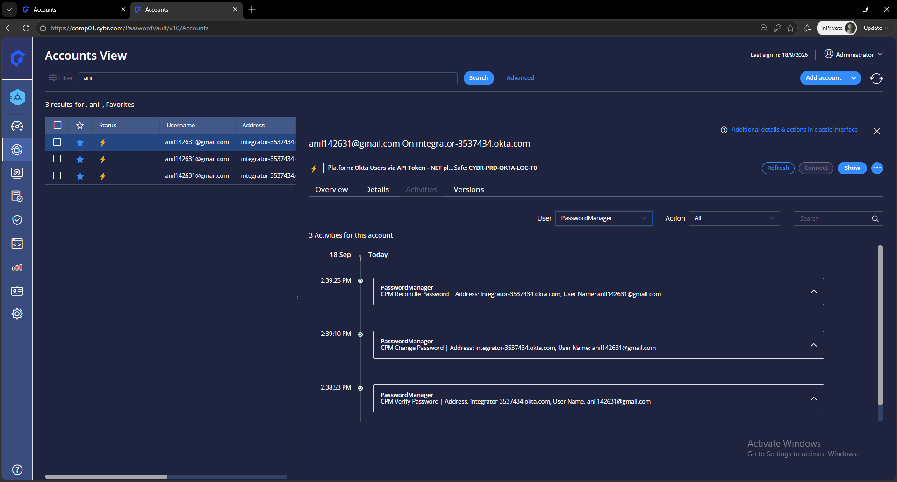

# Idira-CPM-OKTA-API — CyberArk CPM .NET plugin for Okta accounts (API token)

**Author / Developer:** Anilkumar Dadi — Anilkumar.Dadi@cyderes.com — Cyderes
**Version:** 1.0 — **Developed:** 15 September 2026

A custom CyberArk Central Policy Manager (CPM) plugin that lets CyberArk PAM (Self-Hosted or Privilege Cloud /
Idira) **verify, change and reconcile the passwords of accounts that live only in Okta** — break-glass Super
Administrators, Okta-only service users, partner identities. CyberArk ships no platform for these; this plugin fills
the gap.

The CPM authenticates to Okta with an **Okta API token** held in the Vault as a linked account, and calls the Okta
Users API. The plugin is a compiled **.NET SDK plugin** (`OktaApiTokenPlugin.dll`) built on the CyberArk Credentials
Management .NET SDK — no Terminal Plugin, no REST framework, no Visual Studio.

The same DLL also manages the **API token account itself** (a second platform with `OktaObjectType=ApiToken`):
Verify keeps the token alive and proves it; Change through *specify next password* validates the new token, revokes
the old one in Okta and vaults the new value; impossible operations are refused safely (Okta cannot create tokens
by API).

Proven end to end from PVWA on the lab (Verify, Change, Reconcile, logon, prereconcile — all RC 0).

---

## Why a .NET plugin, and why an API token

| Approach | Outcome |
|---|---|
| CyberArk REST API Application Plugin Framework | Rejects Okta's `SSWS` authorization scheme (only Basic / Bearer) — cannot be used |
| Terminal Plugin (TPC + PowerShell) | Works, but relies on prompt matching and `RESULT:` line parsing |
| **.NET SDK plugin (this repo)** | Builds its own HTTP requests, so `Authorization: SSWS <token>` is set directly; typed return codes with readable messages in PVWA; one code base |

An Okta API token is the fastest credential to put in place (created in the Admin Console, no app registration). The
plugin recognises the token by its shape (42 characters starting with `00`) and uses it as the SSWS authorization on
every call.

## How the CPM manages an account

Every managed Okta account links the **token account** as its Logon and Reconcile account. The CPM decrypts the
token into the plugin process for one action; it is never on disk or in a script.

| CPM action | Class | What happens | Okta call |
|---|---|---|---|
| logon | `Logon` | Token usable? (connectivity check before a Change) | — |
| verifypass | `Verify` | User is ACTIVE and Okta-sourced; with `StrictVerify=Yes` the stored password is authenticated | `GET /api/v1/users/{login}`, `POST /api/v1/authn` |
| changepass | `Change` | Set the CPM-generated password, validating the current one; revoke sessions | `POST /api/v1/users/{id}/credentials/change_password` |
| prereconcilepass | `Prereconcile` | Reconcile token usable? | — |
| reconcilepass | `Reconcile` | Admin-set the CPM-generated password (no current password needed) | `POST /api/v1/users/{id}` |

A wrong stored password returns **8413**; the platform lists 8413 as a reconcile reason, so the CPM reconciles the
account automatically.

## Repository layout

```
src/
  Actions.cs              the five action classes the invoker discovers by ActionName (route to users or token logic)
  BaseAction.cs           accounts, platform settings, secret retrieval, credential-account lookup, error mapping
  OktaApiClient.cs        HTTP client: SSWS authorization, Users API calls, token owner lookup, token revocation
  TokenAccountActions.cs  token-account platform: verify (keep-alive), change via specify next password, refusals
  OktaRc.cs               return codes and OktaException
  AssemblyInfo.cs         assembly identity 1.0.0.0
build.ps1                 builds OktaApiTokenPlugin.dll with csc.exe on the CPM server
platform/
  Policy-OktaUsersApiToken.ini / .xml     managed Okta accounts (PolicyID OktaUsersApiToken)
  Policy-OktaApiTokenAccount.ini / .xml   the token account itself (PolicyID OktaApiTokenAccount, OktaObjectType=ApiToken)
tools/
  oktaapitoken-test.ini            parameters template for invoker tests - users platform
  oktaapitoken-account-test.ini    parameters template for invoker tests - token-account platform
docs/
  BUILD-AND-DEPLOY.md            step-by-step: Okta, build, deploy, invoker test, platform, vault, PVWA tests
  lab-evidence/                  plugin log of the successful PVWA run
  screenshots/                   lab screenshots
```

## Quick start

1. **Okta** — service administrator (Super Administrator when targets are admins) → sign in as that user → Security
   → API → Tokens → Create token. Prove it: `GET /api/v1/users/me` with `Authorization: SSWS <token>`.
2. **Build on the CPM server**
   ```powershell
   Get-ChildItem <kit> -Recurse | Unblock-File
   cd <kit>; .\build.ps1        # Built ...\OktaApiTokenPlugin.dll (≈30 KB)
   ```
3. **Deploy**
   ```powershell
   $bin = "C:\Program Files (x86)\CyberArk\Password Manager\bin"
   Copy-Item .\OktaApiTokenPlugin.dll "$bin\" -Force
   New-Item -ItemType Directory -Force "$bin\OktaUsersApiToken\1.0.0" | Out-Null
   Copy-Item .\OktaApiTokenPlugin.dll "$bin\OktaUsersApiToken\1.0.0\" -Force
   ```
4. **Invoker test** (before any platform work) — fill `tools\oktaapitoken-test.ini`, run from `$bin`:
   ```powershell
   $dll = "$bin\OktaApiTokenPlugin.dll"
   .\CANetPluginInvoker.exe oktaapitoken-test.ini verifypass $dll True     # RC = 0
   ```
5. **Platform** — zip the two files in `platform\` at the archive root → PVWA → Platform Management → Import →
   activate → restart the CPM. Name and settings are in the INI (`Okta Users via API Token - NET plugin`).
6. **Vault** — token account (Username = service admin, Password = token) on an unmanaged platform; managed
   account on the new platform; link the token account as Logon **and** Reconcile.
7. **PVWA** — Verify → Change → Reconcile. See `docs/BUILD-AND-DEPLOY.md` for every step and the expected log lines.

## What the lab showed



```
Verify :: run -> START
BaseAction :: PickCredentialAccount -> Linked accounts -> LogOnAccount=index=1 username=svc-cyberark@lab.test ... ReconcileAccount=index=3 ...
BaseAction :: BuildContext -> Okta org=integrator-3537434.okta.com target=anil142631@gmail.com credential=API token (SSWS) ...
Credential is an Okta API token (SSWS) - calling the Users API with it directly
User anil142631@gmail.com id=00u... status=ACTIVE provider=OKTA
Primary authentication for anil142631@gmail.com returned status SUCCESS
exit code = 0   Message = Okta user anil142631@gmail.com verified (password accepted by Okta).
```

Full log: `docs/lab-evidence/plugin-log-2026-09-18.log`.

## The token account platform

| CPM action | What the plugin does | Result |
|---|---|---|
| Verify (periodic, every 7 days) | `GET /api/v1/users/me` with the vaulted token | RC 0 — proves the token and resets Okta's 30-day inactivity expiry |
| Change → *specify next password* | Proves the new token, checks it belongs to the same administrator, revokes the old token (`DELETE /api/v1/api-tokens/current`) | RC 0 — the CPM vaults the new token |
| Change (periodic or CPM-generated) | Refused — a generated password can never be an Okta token | 8451, nothing changes |
| Reconcile | Refused — Okta has no API to create a token | 8452 |

Rotation therefore needs one human act (creating the new token in the Admin Console); everything else — validation,
keep-alive, revoking the old token, storing the new one — is the CPM.

## Return codes

| Code | Meaning |
|---|---|
| 0 | Success |
| 8413 | Stored password wrong — automatic reconcile |
| 8414 | New password rejected by the Okta password policy |
| 8401 | Okta rejected the API token (revoked / expired) |
| 8403 | Token owner lacks the admin role for this user |
| 8404 | User not found |
| 8420 | User not ACTIVE or not Okta-sourced |
| 8429 | Okta rate limit |
| 8450 | Credential secret empty or not an Okta API token |
| 8460 | Required parameter missing |
| 8451 | Token account: the new value is not an Okta API token (use specify next password) |
| 8452 | Token account: reconcile impossible |
| 8453 | Token account: the new token belongs to a different administrator |
| 8000 | Okta org unreachable |
| 8999 | Unexpected error — detail in the message |

## Three things to know before deploying elsewhere

- **SDK build mismatch.** The invoker loads the SDK from `bin\`, the plugin AppDomain from `bin\_common`. If the two
  copies are different builds, passwords are silently dropped in transit and every CPM-driven run fails with 8450
  while invoker tests pass. Compare with `Get-FileHash` first.
- **Platform import.** Files at the zip root; use an XML that PVWA itself exported (change only `Policy ID`) if a
  hand-written one is rejected; the platform name may contain only letters, numbers, spaces and hyphens.
- **The API token cannot be created or rotated by API.** Okta has no such endpoint (`POST /api/v1/api-tokens` →
  405). The token-account platform automates everything around that fact: keep-alive, validation of a new token
  entered through *specify next password*, revocation of the old one, and safe refusal of impossible operations.

## Security notes

- No secret is ever logged, even with `Debug=Yes`.
- Set `Debug=No` in production. Restrict the token to the CPM egress network zone in Okta.
- Nothing in this repository contains a token, a password or a key; `.gitignore` keeps filled test files out.

## References

- CyberArk Docs — Create CPM plugins (Credentials Management .NET SDK)
- CyberArk Marketplace — Credential Management Framework Bundle (CANetPluginInvoker.exe, SDK assemblies)
- Okta Developer — Users API, Authentication API, API tokens
