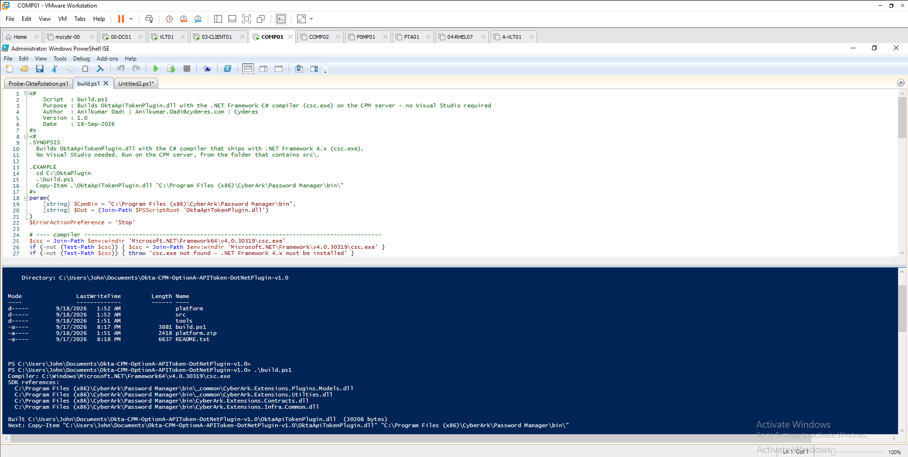
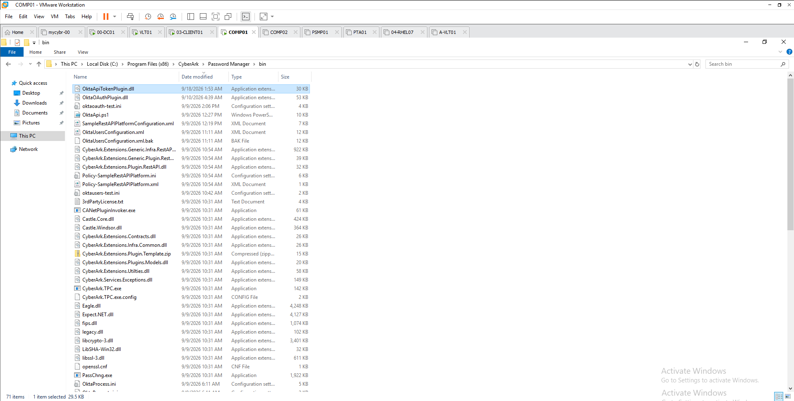
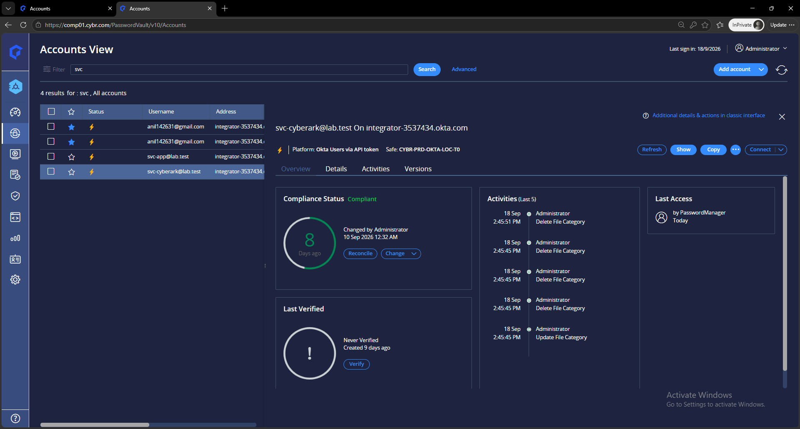
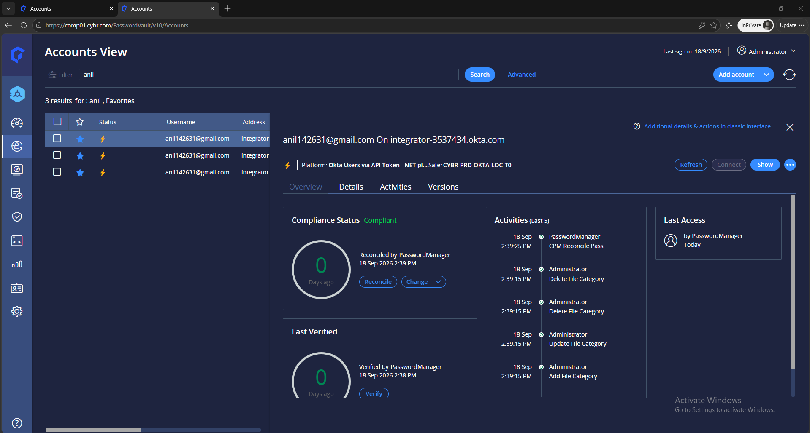
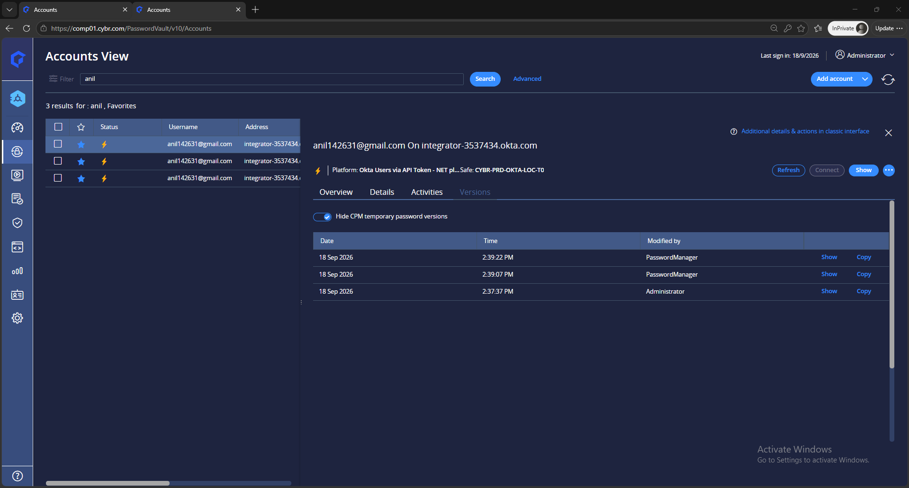

# Build, deploy and test — step by step

Author: Anilkumar Dadi — Anilkumar.Dadi@cyderes.com — Cyderes · Version 1.0 · 15 September 2026

Lab: PAM Self-Hosted 15.2.1 (PVWA comp01.cybr.com), CPM at `C:\Program Files (x86)\CyberArk\Password Manager`,
Okta Integrator org `integrator-3537434.okta.com`, service administrator `svc-cyberark@lab.test`, managed account
`anil142631@gmail.com`, safe `CYBR-PRD-OKTA-LOC-T0`.

## 1. Okta

1. Directory > People > Add person `svc-cyberark@lab.test` (password set by admin, no forced change). Admin roles >
   **Super Administrator** (needed whenever a managed account is itself an admin).
2. Sign in as that user in a private window (enrol MFA) > Security > API > Tokens > **Create token** "CyberArk CPM
   lab". Copy the value — shown once.
3. Prove the token:
   ```powershell
   $h = @{ Authorization = "SSWS <token>"; Accept = 'application/json' }
   Invoke-RestMethod https://integrator-3537434.okta.com/api/v1/users/me -Headers $h | Select id,status
   Invoke-RestMethod https://integrator-3537434.okta.com/api/v1/users/anil142631@gmail.com -Headers $h | % { $_.status; $_.credentials.provider.type }   # ACTIVE, OKTA
   ```
4. Note the Okta password policy and mirror it in the platform's Generate Password settings.

## 2. Build

```powershell
$kit = "C:\Users\John\Documents\Okta-CPM-OptionA-APIToken-DotNetPlugin-v1.0"
Get-ChildItem $kit -Recurse | Unblock-File
cd $kit; .\build.ps1
# Compiler: C:\Windows\Microsoft.NET\Framework64\v4.0.30319\csc.exe
# SDK references: bin\_common\CyberArk.Extensions.Plugins.Models.dll, bin\_common\CyberArk.Extensions.Utilties.dll, ...
# Built ...\OktaApiTokenPlugin.dll (30208 bytes)
```



## 3. Deploy

```powershell
$bin = "C:\Program Files (x86)\CyberArk\Password Manager\bin"
Copy-Item "$kit\OktaApiTokenPlugin.dll" "$bin\" -Force
New-Item -ItemType Directory -Force "$bin\OktaUsersApiToken\1.0.0" | Out-Null
Copy-Item "$kit\OktaApiTokenPlugin.dll" "$bin\OktaUsersApiToken\1.0.0\" -Force
```

The CPM looks in `bin\<PluginId>\<PluginVersion>\` first and falls back to `bin\` (the lab log shows the fallback
path in use).

**Check the SDK copies match** — different builds in `bin` and `bin\_common` silently drop passwords:
```powershell
Get-FileHash "$bin\CyberArk.Extensions.Plugins.Models.dll","$bin\_common\CyberArk.Extensions.Plugins.Models.dll","$bin\CyberArk.Extensions.Utilties.dll","$bin\_common\CyberArk.Extensions.Utilties.dll" -Algorithm SHA256
```



## 4. Invoker test

Copy `tools\oktaapitoken-test.ini` to `$bin`, fill `[targetaccount]` (login, current password, new password) and
`[extrapass1]` / `[extrapass3]` (`username=svc-cyberark@lab.test`, `password=<token>`), then from `$bin`:

```powershell
$dll = "$bin\OktaApiTokenPlugin.dll"
.\CANetPluginInvoker.exe oktaapitoken-test.ini logon            $dll True
.\CANetPluginInvoker.exe oktaapitoken-test.ini verifypass       $dll True
.\CANetPluginInvoker.exe oktaapitoken-test.ini changepass       $dll True   # then update password= in the ini
.\CANetPluginInvoker.exe oktaapitoken-test.ini prereconcilepass $dll True
.\CANetPluginInvoker.exe oktaapitoken-test.ini reconcilepass    $dll True
# each: The plugin ended successfully (RC = 0)
```
Delete the filled ini afterwards.

## 5. Platform

Zip `platform\Policy-OktaUsersApiToken.ini` and `Policy-OktaUsersApiToken.xml` **at the archive root** → PVWA >
Platform Management > Import platform → activate → restart the CPM service.

Importer messages seen in the lab and their fixes:

| Message | Fix |
|---|---|
| Platform zip file does not contain a policy INI file | Files must be at the zip root, not in a folder |
| Platform xml file is invalid | Use an XML that PVWA itself exported (any .NET platform) and change only `Policy ID="OktaUsersApiToken"` |
| EPVWF10080E Platform name must not exceed 100 characters and can not contain characters other than letters, numbers … | `PolicyName=Okta Users via API Token - NET plugin` (no parentheses or dots) |

Settings to confirm after import: `DllName=OktaApiTokenPlugin.dll`, `ExeName=CANetPluginInvoker.exe`,
`RCReconcileReasons=8413`, `RevokeSessionsOnChange=Yes`, `StrictVerify` as required, `Debug=Yes` while testing;
Verification periodic (keeps the token alive); Reconciliation automatic when unsynched.

## 6. Vault objects

1. **Token account** — safe `CYBR-PRD-OKTA-LOC-T0`, any unmanaged platform: Address `integrator-3537434.okta.com`,
   Username `svc-cyberark@lab.test`, Password = the token.
   
2. **Managed account** — platform *Okta Users via API Token - NET plugin*: Address `integrator-3537434.okta.com`,
   Username `anil142631@gmail.com`, Password = current password. Linked accounts > Logon = token account,
   Reconcile = token account.

## 7. Tests from PVWA (18 September 2026)

| # | Action | Result |
|---|---|---|
| 1 | Verify (StrictVerify=Yes) | RC 0 — "Okta user anil142631@gmail.com verified (password accepted by Okta)." |
| 2 | Change | RC 0 — "Password changed for anil142631@gmail.com (sessions revoked)." |
| 3 | Reconcile | RC 0 — "Password reconciled (admin-set) for anil142631@gmail.com." |





Plugin log: `lab-evidence/plugin-log-2026-09-18.log` (`Logs\ThirdParty\Debug_OktaUsersApiToken*.log` on the CPM).

## 8. Operations

- **Token rotation** is manual by Okta design (no create/rotate API): create a new token as the service admin →
  PVWA Change > specify next password on the token account → Verify a managed account → revoke the old token.
- **Keep-alive**: periodic Verify on managed accounts uses the token, so it never idles past Okta's 30-day limit.
- **Debug=No** after the rollout. The plugin never logs secrets in either mode.
